<p align="center">
  
</p>

<p align="center">
  <strong>End-to-end genotype processing & cleaning for diploid <em>Prunus</em> full-sib families</strong>
</p>

<p align="center">
  <a href="https://www.python.org/"></a>
  <a href="#supported-platforms"></a>
  <a href="LICENSE"></a>
  <a href="https://doi.org/10.1093/hr/uhaf087"></a>
  <a href="https://github.com/fanjiaqi777/PreMap-V1.0-release/stargazers"></a>
</p>

---

## Overview

**PreMap** transforms raw variant calls (VCF 4.2+) or custom marker matrices into clean, phased, map-ready genotype bins — fully automated, with a complete audit trail. Designed for diploid *Prunus* full-sib families, it accepts any biallelic marker type (SNP, INDEL, etc.) and outputs data directly compatible with mainstream linkage-mapping software.

<p align="center">
  
</p>

### Key Features

| Feature | Description |
|:--------|:------------|
| **Dual-channel input** | SNP & INDEL from VCF, or any biallelic marker via Excel |
| **Pseudo-testcross strategy** | Automatic segregation classification (1:1, 1:2:1, Parent-specific) |
| **Robust phasing** | Triple-threshold (s/l/m) phase correction with IBD detection |
| **Recombination binning** | Individual-level breakpoint identification & population-level minimal units |
| **Error correction & imputation** | Genotype correction with full change logging |
| **Zero-dependency deployment** | Pre-built executables — no Python installation needed |
| **Cross-platform** | Linux CLI + Windows GUI |

---

## Pipeline Modules

```
Step 0 ─── VCF normalization, splitting & recoding ──────────── (Linux only)
Step 0.5 ─ Compute genotype frequencies & statistics
Step 1 ─── Cleaning, filtering & pseudo-testcross classification
Step 2 ─── Phase correction & cluster cleaning (IBD detection)
Step 3 ─── Binning — individual-level breakpoint identification
Step 4 ─── OneBins — population-level bin markers, correction & imputation
Step-Add ─ Additional statistics for sequencing data (hybrid verification)
```

---

## Quick Start

### 1. Download

```bash
git clone https://github.com/fanjiaqi777/PreMap-V1.0-release.git
cd PreMap-V1.0-release
```

### 2. Run the pipeline

All executables are in the `dist/` directory and require **no Python environment**.

```bash
# Step 0: VCF processing (Linux only)
./dist/run_step0 -i input.vcf

# Step 0.5: Pre-process Excel
./dist/run_step0_5 -i input_file.xlsx

# Step 1–4: Main workflow
./dist/run_step1 -i chr1_markers.xlsx
./dist/run_step2 -i chr1_cleaned.xlsx
./dist/run_step3 -i chr1_phased.xlsx
./dist/run_step4 -i chr1_binned.xlsx

# Additional: Weighted correction (sequencing data)
./dist/run_step_addition_caculation -i chr1_onebins.xlsx
```

> **Windows users**: A GUI interface is provided. See the [User Guide](docs/User-Guide.html) for details.

---

## System Requirements

| Scale | Samples | Minimum | Recommended |
|:------|:--------|:--------|:------------|
| Small | ≤ 150 | 4-core, 8 GB RAM, 20 GB disk | 8-core, 8 GB RAM, SSD |
| Medium | 150–400 | 8-core, 32 GB RAM, 100 GB | 16-core, 64 GB RAM, SSD |
| Large | ≥ 400 | 16-core, 64 GB RAM, 200 GB SSD | 24–32-core, 128 GB RAM, NVMe |

> **Note**: Step 0 is Linux-only due to data volume and memory requirements. All other steps run on both Linux and Windows.

---

## Supported Platforms

| Module | Linux | Windows |
|:-------|:-----:|:-------:|
| Step 0 (VCF processing) | ✅ | — |
| Step 0.5 – Step 4 | ✅ CLI | ✅ GUI |
| Step-Addition | ✅ CLI | ✅ GUI |

---

## Documentation

The full **bilingual User Guide** (English / 中文) with step-by-step instructions, parameter references, screenshots, and input templates is available here:

**[📖 Open User Guide](docs/User-Guide.html)**

> **Tip**: Clone the repo and open `docs/User-Guide.html` in your browser for the best reading experience with sidebar navigation and language switching.

---

## Repository Structure

```
PreMap-V1.0-release/
├── dist/                   # Pre-built executables (Linux & Windows)
│   ├── run_step0           # VCF processing
│   ├── run_step0_5         # Statistics computation
│   ├── run_step0_indel     # INDEL-specific processing
│   ├── run_step1           # Cleaning & filtering
│   ├── run_step2           # Phase correction
│   ├── run_step3           # Binning
│   ├── run_step4           # OneBins processor
│   └── run_step_addition_caculation
├── docs/                   # Documentation
│   └── User-Guide.html     # Full bilingual user manual
├── test/                   # Example datasets
│   └── Chip-data/          # Chip genotyping test data
├── images/                 # Documentation figures
├── LICENSE                 # CC BY-NC-ND 4.0
├── CITATION.cff            # Machine-readable citation metadata
├── CHANGELOG.md            # Version history
└── README.md
```

---

## Test Data

A reproducible test dataset is available on Figshare:

**[https://doi.org/10.6084/m9.figshare.30043073.v2](https://doi.org/10.6084/m9.figshare.30043073.v2)**

---

## Citation

If you use PreMap in your research, please cite:

> Fan J, Wu J, Arús P, Li Y, Cao K, Wang L (2025). Integrating whole-genome resequencing and machine learning to refine QTL analysis for fruit quality traits in peach. *Horticulture Research*, **12**(7): uhaf087.
> [https://doi.org/10.1093/hr/uhaf087](https://doi.org/10.1093/hr/uhaf087)

---

## License

This project is licensed under [CC BY-NC-ND 4.0](https://creativecommons.org/licenses/by-nc-nd/4.0/) — free for **academic research** and **non-commercial breeding activities**. Commercial use, redistribution of modified versions, and reverse engineering are prohibited. See [LICENSE](LICENSE) for full terms.

For commercial or integration licenses, contact [fjq690510307@gmail.com](mailto:fjq690510307@gmail.com).

---

## Acknowledgments

- **Development team**: Peach Germplasm Resources and Breeding Innovation Team
- **Collaborating team**: IRTA Rosaceae Genetics and Genomics Research Team
- **External tools referenced**: VCF 4.2+ specification, bcftools, vcftools

---

## Contact

**Jiaqi Fan** — [fjq690510307@gmail.com](mailto:fjq690510307@gmail.com)

GitHub: [@fanjiaqi777](https://github.com/fanjiaqi777)

---

<p align="center">
  <sub>Built with Python &nbsp;·&nbsp; Pandas &nbsp;·&nbsp; NumPy &nbsp;·&nbsp; Jupyter</sub>
</p>
